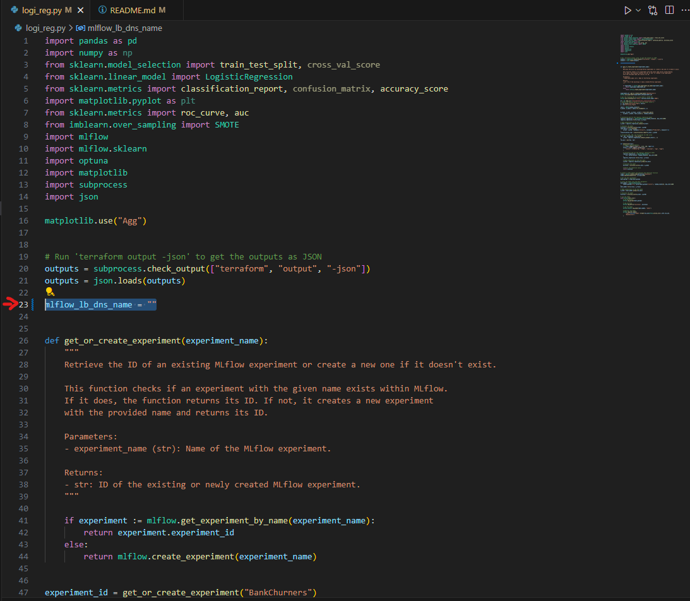

<h1 align="center">
MLFlow + AWS + Terraform
</h1>

<p align="center">
    <br>
    <a></a>
    <br>
    <br>
    <h2 align="center">Using:
    <br>
    <br>
    <a></a>
    <a></a>
    <a></a>
    <br>
</p>

## 📖 Description

This project was created with the intention of using Terraform to create an AWS instance to host an MLFlow server. We then use said MLFlow server to store models we are planning to train.

## 📋 Objectives

- To start off, we had to use Terraform to set up our AWS Structure. To do so, we used:

  - **RDS** to create a PostgreSQL database.
  - **S3** to create a Bucket, where we will store our data.
  - **EC2** to create an Amazon Linux instance, where we will run our **MLFlow** server.
- Once that was done, we adapted some of our Analyst colleagues' work to MLFlow, with the following changes:

  - Hyperparameter tuning using **Optuna**.
  - Adapting their code to write into the **MLFlow** server being run on the AWS instance.

## 🛠️ Setup & Installation

- Create a new virtual environment by executing this command in your terminal:
  `python3 -m venv mlops`
- Activate the environment by executing this command in your terminal:
  `source mlops/bin/activate`
- Install the required dependencies by executing this command in your terminal:
  `pip install -r requirements.txt`

You are also required to have Terraform installed. You can download it [here](https://developer.hashicorp.com/terraform/install?product_intent=terraform), and all you need to do is add it to your system environment's PATH variable.
## 👩‍💻 Usage

This project uses Terraform to create an AWS instance. The only pre-requirement is to have an already existing Key-Pair for an EC2 instance, which you can create [right here](https://eu-central-1.console.aws.amazon.com/ec2/home?region=eu-central-1#KeyPairs:). You put the key name under the `key_name` field inside of `/terraform/ec2.tf.


After installing `requirements.txt`, please run the following commands from the project folder to set up your AWS instance:

```
cd terraform
```

```
terraform init
```

```
terraform apply
```

After running `terraform apply`, it will ask you if you want to apply it, in which case you just type `yes`, and enter.

Give it some time to run, and it should set up your instance for you. Once the instance has been set up, all you have to do, is make sure the Public IPv4 address of the AWS instance is set inside of `logi_reg.py`, under the `mlflow_lb_dns_name` parameter.



## 📦 Project Structure

```
.
├── assets/
│   ├── key.png
│   ├── keypair.png
│   └── mlflow.png
├── data/
│   └── BankChurners_preprocessed.csv
├── terraform/
│   ├── ec2.tf
│   ├── provider.tf
│   ├── rdspostgresql.tf
│   ├── s3bucket.tf
│   ├── securitygroups.tf
│   └── variables.tf
├── .gitattributes
├── .gitignore
├── logi_reg.py
├── README.md
└── requirements.txt
```
